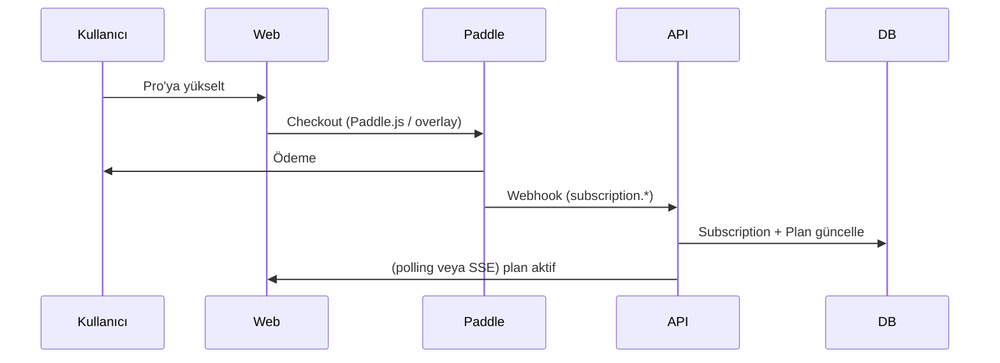

# Sprint 3 — Monetization ve premium

**Amaç:** Ürün **para kazanmaya başlasın**: **Paddle** ile ödeme, **free / pro** planlar, **özellik kilidi**, **şablon paketleri**, **brand kit**. Sprint 1–2’deki doküman ve kullanıcı modelinin üzerine oturur.

### Auth ve monetization sırası

- **Paddle / plan / webhook** önceliği korunur; kullanıcı kaydı için **e-posta+şifre** (Sprint 2) yeterlidir.
- **Google OAuth** (ve ileride diğer sağlayıcılar) **monetization ile çakışmaz**; `User` + `Subscription` aynı kalır. Öneri: **checkout akışı ve webhook’lar** oturduktan sonra veya paralel ikinci iş kolunda **tek sağlayıcı (Google)** — detay [`10-plan-002-auth-identity-roadmap.md`](./10-plan-002-auth-identity-roadmap.md).
- **Invite / workspace:** Davet token’ı e-postaya bağlıdır; kullanıcı ilk girişi OAuth veya şifre ile yapabilir — **hesap birleştirme** kuralları roadmap’te.

---

## 1. Subscription flow (Paddle)

### Akış özeti



### Teknik parçalar

| Bileşen | Rol |
|---------|-----|
| **Paddle Billing** | Abonelik, fatura, vergi (MCC’ye göre) |
| **Client** | Paddle.js: `Paddle.Checkout.open` veya inline checkout |
| **Webhook** | `subscription.created`, `subscription.updated`, `subscription.canceled`, `transaction.completed` — imza doğrulama zorunlu |
| **DB** | `Subscription` satırı: `paddleSubscriptionId`, `paddleCustomerId`, `status`, `planKey`, `currentPeriodEnd` |

### Webhook sonrası

1. Payload’ı doğrula (Paddle public key / secret).
2. Kullanıcıyı `custom_data.userId` veya e-posta ile eşle.
3. `User.plan` veya ayrı `Subscription` tablosunu güncelle.
4. Idempotent işleme: aynı `event_id` iki kez işlenmesin.

### İptal / downgrade

- İptal: dönem sonuna kadar pro özellikleri (grace) veya anında free — **ürün kararı**; dokümanda: `status === canceled` → `planKey = free` veya `graceUntil`.
- **Paddle Customer Portal** linki: kullanıcı faturalama ve iptal için.

---

## 2. Plan sistemi (free vs pro)

### Plan tanımı (config veya DB seed)

| Plan | `planKey` | Fiyat (örnek) | Amaç |
|------|-----------|----------------|------|
| Free | `free` | 0 | Geniş kullanım, sınırlı özellik |
| Pro | `pro` | Paddle ürün ID ile | Watermark kaldırma, premium tema, limitsiz export, şablon paketleri, brand kit |

### `User` / `Subscription` genişletmesi

`User` üzerinde:

- `planKey` enum: `free` \| `pro` (cache; kaynak: aktif subscription)
- veya sadece `Subscription` tablosu: tek aktif satır kullanıcı başına

Öneri: **`Subscription`** kaynak, `User.planKey` denormalize (hızlı middleware).

```text
Subscription {
  userId
  planKey        // free | pro
  status         // active | canceled | past_due | trialing
  paddleId       // external ids
  currentPeriodEnd
}
```

Free kullanıcılar için **satır yok** veya `planKey: free` + `status: active` (synthetic).

---

## 3. Feature flag sistemi

### Yaklaşım: yetenek matrisi (capabilities)

Kodda tek doğruluk kaynağı: **`getCapabilities(userId | planKey)`** → `Record<FeatureKey, boolean | number>`.

| `FeatureKey` | Free | Pro |
|--------------|------|-----|
| `watermark` | true (PDF’de watermark) | false |
| `themes.premium` | false | true |
| `export.unlimited` | false (ör. ayda 10) | true |
| `templates.proposal` | false | true |
| `templates.report` | false | true |
| `brandKit` | false | true |

### Uygulama

1. **`packages/core/capabilities.ts`** — plan → capability map (statik).
2. **Server middleware** — `requireCapability('export.unlimited')` veya sayı kontrolü `getExportQuota(user)`.
3. **PDF / export route** — watermark HTML katmanı: `if (caps.watermark) appendWatermarkLayer()`.
4. **UI** — paywall modal: “Pro’ya geç” → Paddle checkout.

### Sayısal limit (free export)

- `UsageCounter` tablosu: `{ userId, month, exportCount }` veya Paddle metered billing sonraya bırakılabilir.
- Basit: DB sayaç + ay başı reset (cron veya lazy check).

---

## 4. Pricing sayfası yapısı

### Route

- `/pricing` — herkese açık (auth gerekmez).

### Bölümler

1. **Hero** — tek cümle değer önerisi.
2. **Plan kartları** — Free vs Pro; özellik listesi (checkmark).
3. **SSS** — faturalama, iptal, vergi (Paddle açıklaması).
4. **CTA** — Pro: `Paddle.Checkout.open({ items: [{ priceId: ENV.PADDLE_PRICE_PRO }] })`.
5. **Mevcut kullanıcı** — oturum varsa “Mevcut planın: Free” + yükselt butonu.

### Ortam değişkenleri

- `NEXT_PUBLIC_PADDLE_CLIENT_TOKEN`
- `PADDLE_API_KEY` (server)
- `PADDLE_WEBHOOK_SECRET`
- `PADDLE_PRICE_ID_PRO` (veya product id)

### Yasal

- Ödeme sayfası Paddle üzerinde host edilebilir veya overlay; **şartlar ve gizlilik** linkleri.

---

## 5. Kullanıcı plan kontrolü

### Sunucu tarafı (asıl güvenlik)

```text
async function getEffectivePlan(userId: string): Promise<'free' | 'pro'> {
  const sub = await getActiveSubscription(userId);
  if (sub?.status === 'active' && sub.planKey === 'pro') return 'pro';
  return 'free';
}
```

### Middleware örnekleri

- **API:** `POST /api/documents/:id/export/pdf` — önce `getEffectivePlan`; free ise kota; pro ise sınırsız.
- **SSR:** `/dashboard` — plan rozeti; kilitli tema seçimi.

### Client

- `usePlan()` hook — `/api/me` veya session’dan `planKey` (sadece UI; yetki her zaman server’da).

---

## 6. Template sistemi mimarisi (proposal / report)

### Katmanlar

| Katman | İçerik |
|--------|--------|
| **Data** | Normalize `Document` JSON (Sprint 1) — değişmez. |
| **Layout pack** | `proposal` \| `report` — bölüm sırası, kapak, TOC, sayfa kırımı için ipuçları. |
| **Theme** | Renk/font (Sprint 1 tema + Sprint 3 brand kit ile override). |
| **Render** | `render-html(blocks, { layoutPack, theme, brandKit })` |

### Dosya yapısı (öneri)

```
packages/templates/
  proposal/
    layout.json       # sections: hero, problem, solution, pricing, cta
    styles.css        # sadece layout’a özel
  report/
    layout.json
    styles.css
```

### Feature gate

- `templates.proposal` ve `templates.report` capability **false** ise: UI’da şablon seçimi disabled veya “Pro” rozeti; API `422` + `upgrade_required`.

### PDF

- Aynı HTML pipeline; layout pack ek CSS inject.

---

## 7. Brand kit

### Model (User veya ayrı tablo)

**`BrandKit`** (öneri: kullanıcı başına bir satır)

| Alan | Açıklama |
|------|----------|
| `userId` | FK unique |
| `logoUrl` | (Sprint 2 ile birleşebilir; burada “kit” ana kaynak) |
| `primaryColor` | hex |
| `secondaryColor` | hex opsiyonel |
| `fontFamily` | string (Google Fonts adı veya sistem) |

**Gate:** `brandKit` capability yoksa kayıt API’si 403 veya sadece free alanlar (sadece logo).

### Render

- CSS değişkenleri: `--brand-primary`, `--font-body`
- PDF: aynı değişkenler inline veya `<style>` ile Puppeteer’a

---

## 8. Özet: Sprint 3 teslim checklist

- [ ] Paddle ürün + fiyat + webhook URL (staging + prod)
- [ ] `Subscription` + webhook işleyici
- [ ] `getCapabilities` + export kota + watermark
- [ ] `/pricing` sayfası + checkout CTA
- [ ] Template pack’ler (proposal, report) + gate
- [ ] `BrandKit` CRUD + PDF/HTML’e enjekte

---

## 9. İlişkili dokümanlar

- [`30-spec-001-sprint1-mvp.md`](./30-spec-001-sprint1-mvp.md)
- [`30-spec-002-sprint2-delivery-profile.md`](./30-spec-002-sprint2-delivery-profile.md)
- [`10-plan-001-document-saas.md`](./10-plan-001-document-saas.md)

---

## 10. Risk / sadeleştirme

- **Paddle sandbox** ile tüm akışı bitirmeden prod’a çıkmayın.
- **Webhook güvenliği** olmadan deploy yok.
- **Metered** faturalama ilk sürümde kapalı; sadece kota sayacı yeterli.
